<a id="readme-top"></a>

<div align="center">
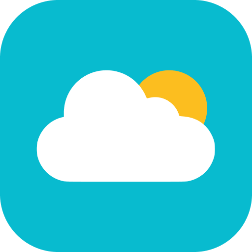

<h3 align="center"><strong>MinWeather</strong></h3>

<p align="center">
Previsões climáticas e atualizações em tempo real.
</p>
<br />
<p> - <a href="https://minweather.tnicolau-dev.com/" target="_blank"><strong>View website</strong></a> - </p>
<br />
</div>

<br />

><br />
>
>## Descrição
>O **MinWeather** é uma aplicação web desenvolvida em PHP que exibe as condições climáticas e previsão do tempo em tempo real da sua localização atual e para qualquer lugar do mundo. Utiliza dados de APIs para fornecer informações como temperatura, precipitação, UV, previsão para os próximos dias, dentre outras.
>
><br />
><br />
>
>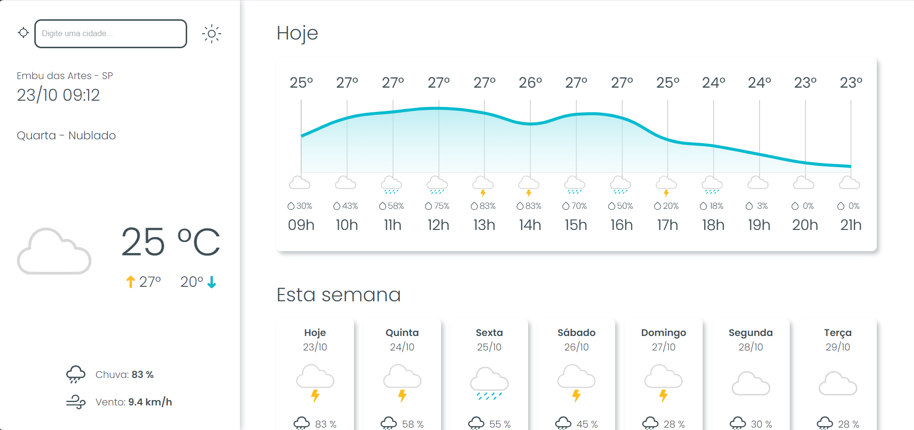
>
><br />
><br />
>
>## Features e Usabilidade
>
>>### 1. Previsão do tempo da localização atual
>><p>O sistema identifica automaticamente sua localização com base no seu IP e busca as informações do clima correspondentes.</p>
>><br />
><p align="right">(<a href="#readme-top">back to top</a>)</p>
><br />
>
>>### 2. Modo claro/escuro
>><p>Para alterar o modo de visualização do site para o modo claro/escuro basta clicar no icone de sol/lua ao lado da barra de pesquisa.</p>
>><br />
>><div align="center">
>>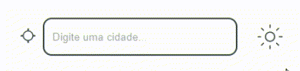
>></div>
>><br />
><p align="right">(<a href="#readme-top">back to top</a>)</p>
><br />
>
>>### 3. Barra de pesquisa
>><p>Ao digitar na barra de pesquisa, irá trazer localizações de todo o mundo que possuem nomes semelhantes. Basta clicar sobre uma delas que o sistema fará a busca. </p>
>><br />
>><div align="center">
>>
>></div>
>><br />
>><br />
>><div align="center">
>>
>></div>
>><br />
><p align="right">(<a href="#readme-top">back to top</a>)</p>
><br />
>
>>### 4. Voltar à localização atual
>><p>Ao clicar no icone do lado esquerdo da barra de pesquisa (semelhando a uma mira) o sistema irá recarregar e buscar sua localização atual. </p>
>><br />
><p align="right">(<a href="#readme-top">back to top</a>)</p>
><br />
>
>>### 5. Informações sobre neve
>><p>Caso a localização em questão possua algum dado referente e neve, irá aparecer um terceiro item junto com as informações de "<strong>chuva</strong>" e "<strong>vento</strong>".</p>
>><br />
>><div align="center">
>>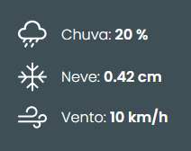
>></div>
>><br />
><p align="right">(<a href="#readme-top">back to top</a>)</p>
><br />
>
>>### 6. Previsão do clima das próximas 12h
>><p>O gráfico mostra a previsão do clima, temperatura e chance de chuva de cada hora para as próximas 12h.</p>
>><br />
>><div align="center">
>>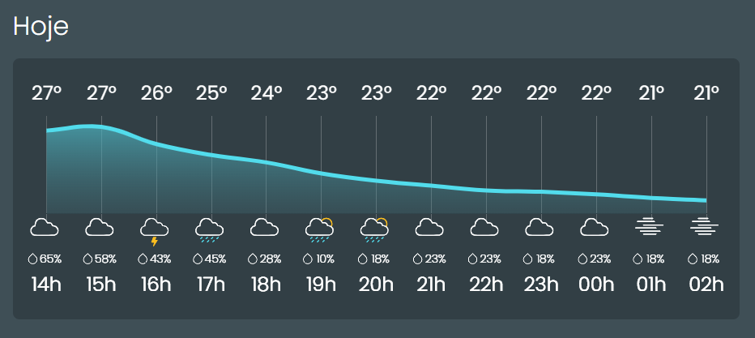
>></div>
>><br />
><p align="right">(<a href="#readme-top">back to top</a>)</p>
><br />
>
>>### 7. Previsão do clima dos próximos 7 dias
>><p>Logo abaixo temos a previsão do clima, temperatura e chance de chuva de cada dia da semana dos próximos 7 dias.</p>
>><br />
>><div align="center">
>>
>></div>
>><br />
><p align="right">(<a href="#readme-top">back to top</a>)</p>
><br />
>
>>### 8. Módulos 
>><p>Ao final da página tem 4 módulos, onde cada um apresenta uma informação diferente:</p>
>><br />
>>
>>>### Nascer e Pôr do Sol
>>>
>>>   Mostra a hora do nascer e pôr do sol de acordo com o <strong>timezone do país</strong>, além de mostrar a posição aproximada do sol em relação a hora atual. Caso esteja de noite ele muda sua cor para azul.
>>>   
>>>   <p align="center">
>>>   <br />
>>>      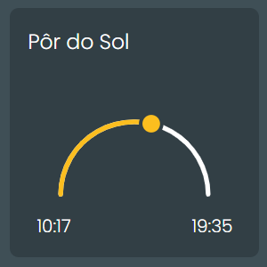
>>>      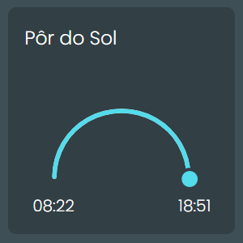
>>>   </p>
>>>   <br />
>>
>><p align="right">(<a href="#readme-top">back to top</a>)</p>
>><br />
>>
>>>### Vento
>>>
>>>Mostra a direção e velocidade atual do vento.
>>>   
>>>   <p align="center">
>>>   <br />
>>>      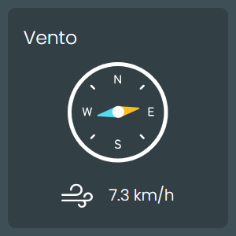
>>>   </p>
>>>   <br />
>>
>><p align="right">(<a href="#readme-top">back to top</a>)</p>
>><br />
>>
>>>### Precipitação
>>>
>>>Mostra o nível de precipitação em milímetros (mm) e visualmente indica se a quantidade é baixa, média, alta ou nenhuma.
>>>   
>>><br />
>>>
>>>><p>Entre 0mm e 5mm - Baixo</p>
>>>><p>Entre 5mm e 20mm - Médio</p>
>>>><p>Maior que 20mm - Alto</p>
>>>
>>><br />
>>>
>>>   <p align="center">
>>>      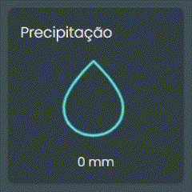
>>>      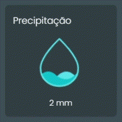
>>>      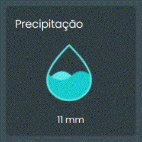
>>>      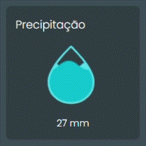
>>>   </p>
>>>   <br />
>><p align="right">(<a href="#readme-top">back to top</a>)</p>
>><br />
>>
>>>### UV
>>>
>>>Mostra o nível de raios UV atual, podendo ser fraco, médio, alto, muito alto e extremo.
>>>  
>>><br />
>>>
>>>><p>Menor que 3 - Baixo</p>
>>>><p>Entre 3 e 6 - Médio</p>
>>>><p>Entre 6 e 8 - Alto</p>
>>>><p>Entre 8 e 10 - Muito Alto</p>
>>>><p>EMaior que 10 - Extremo</p>
>>>
>>><br />
>>>
>>>   <p align="center">
>>>      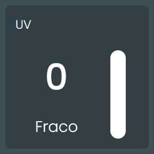
>>>      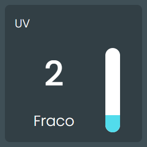
>>>      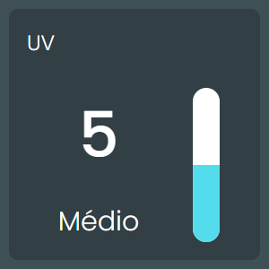
>>>      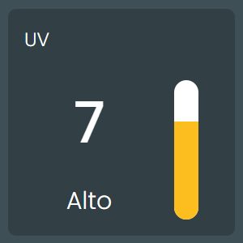
>>>      
>>>      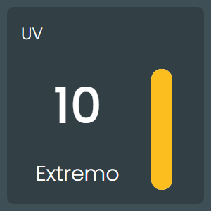
>>>   </p>
>>>   <br />
>>>
>><p align="right">(<a href="#readme-top">back to top</a>)</p>
><br />
>
>## Funcionalidades
>>- Busca do clima pela sua localização atual;
>>- Exibição de temperatura atual, UV, vento, nascer e pôr do sol, precipitação e condições do clima;
>>- Gráfico com a previsão para as próximas 12h;
>>- Previsão para os próximos 7 dias;
>>- Interface responsiva e intuitiva;
>>- Barra de pesquisa para consultar as condições climáticas de qualquer lugar do mundo.
>
><p align="right">(<a href="#readme-top">back to top</a>)</p>
>
>## Tecnologias Utilizadas
>
>
>
>
>
>
>
><br>
>
>### APIs
>
>>- <p><a href="https://ipinfo.io/" target="_blank">ipinfo.io</a> - Busca os dados detalhados do IP fornecido - </p>
>>- <p><a href="https://open-meteo.com/" target="_blank">open-meteo.com</a> - Busca os dados do clima - </p>
>>- <p><a href="https://nominatim.openstreetmap.org/ui/search.html" target="_blank">nominatim.openstreetmap.org</a> - Busca qualquer localização e seus dados geográficos - </p>
>
><p align="right">(<a href="#readme-top">back to top</a>)</p>
>
><br />

<br />

## Instalação

### Pré-requisitos
- **PHP 7.4+**
- **Composer** (para gerenciar dependências)
- Conta no **[ipinfo](https://ipinfo.io/)** para gerar sua apiKey


<br />

### Passos para instalação:
1. Clone o repositório:
   
   ```bash
   git clone https://github.com/tnicolau-dev/MinWeather.git
   cd MinWeather
3. Instale as dependências do projeto com o Composer:
   
   ```bash
   composer install
4. Crie um arquivo .env na raiz do projeto e adicione sua chave da API **[ipinfo](https://ipinfo.io/)**:
   
   ```bash
   API_TOKEN=suachaveaqui
5. Para usar local, descomente o trecho de código que utiliza a API <a href="https://ifconfig.me/" target="_blank">ifconfig.me</a> e comente o trecho atual para busca do IP.
   
   ```php
   $ip = @file_get_contents('https://ifconfig.me');

   if ($ip === false) {
      throw new Exception('Erro ao tentar obter dados da localização.');
   }

6. Inicie seu servidor PHP e acesse via localhost.

<p align="right">(<a href="#readme-top">back to top</a>)</p>
<br />

><br />
>
>## Contato
>
>>- Desenvolvido por Thiago Nicolau - <a href="mailto:tnicolau.dev@gmail.com">tnicolau.dev@gmail.com</a>
>>- LinkedIn - <a href="https://www.linkedin.com/in/tnicolau-dev/" target="_blank">tnicolau-dev</a>
>
><br />
>
>Se tiver dúvidas, sugestões ou quiser contribuir, entre em contato!
>
><p align="right">(<a href="#readme-top">back to top</a>)</p>
><br />
